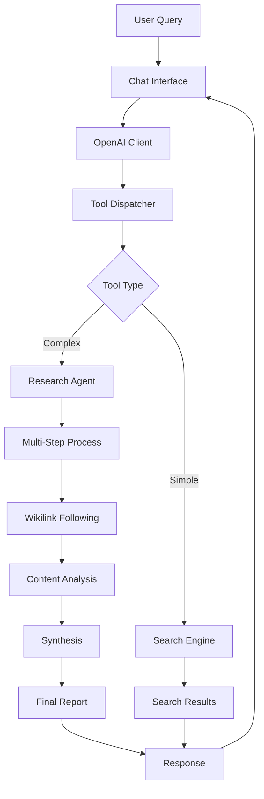

# Obsidian-AI Architecture

## Overview

Obsidian-AI is a sophisticated research assistant that explores personal knowledge bases through intelligent search and wikilink following. The architecture follows clean separation of concerns with distinct layers for business logic, services, infrastructure, and interfaces.

## Architecture Layers

```
src/obsidian_ai/
├── core/                    # 🧠 Core business logic
├── prompts/                 # 📝 Configurable prompt templates
├── services/               # 🔌 External service integrations
├── infrastructure/         # 🏗️ Configuration and file system
└── interfaces/            # 🖥️ CLI, chat, and API interfaces
```

## Core Components

### 🧠 Core (`core/`)

**`search_engine.py`** - Unified multi-strategy search
- `ExactPhraseSearch`: Case-insensitive exact phrase matching
- `KeywordSearch`: Individual keyword search with scoring
- `FilenameSearch`: Partial filename matching
- `UnifiedSearchEngine`: Combines all strategies with deduplication

**`research_agent.py`** - Autonomous research with wikilink following
- Plans research steps using AI reasoning
- Executes searches and follows `[[wikilinks]]`
- Synthesizes findings across multiple iterations
- Generates comprehensive reports

**`wikilink_parser.py`** - Wikilink extraction and processing
- Parses `[[target]]` and `[[target|display]]` formats
- Extracts key terms for related note discovery
- Handles link validation and manipulation

### 📝 Prompts (`prompts/`)

**`base.py`** - Prompt management system
- `PromptTemplate`: Configurable templates with variables
- `PromptManager`: Loading from files/environment
- Environment variable overrides: `OBSIDIAN_AI_PROMPT_*`

**`chat.py`** - Chat system prompts
- Default research assistant behavior
- Tool usage guidelines
- Response quality standards

**`research.py`** - Research-specific prompts
- Step reasoning templates
- Content analysis prompts
- Synthesis and reporting templates

### 🔌 Services (`services/`)

**`openai_client.py`** - OpenAI integration with error handling
- Structured completions with tool support
- Retry logic and error boundaries
- Conversation continuation

**`embedding_service.py`** - Local semantic search
- TF-IDF based embeddings
- Semantic similarity search
- Caching and indexing

### 🏗️ Infrastructure (`infrastructure/`)

**`config.py`** - Configuration management
- Environment variable loading
- Brain directory setup
- Ignore pattern management

**`file_system.py`** - Safe file operations
- Security path validation
- Text file iteration
- Safe reading with error handling

### 🖥️ Interfaces (`interfaces/`)

**`cli.py`** - Command line interface
- Chat, search, and file reading commands
- Verbose logging configuration
- Environment setup

**`chat.py`** - Interactive chat sessions
- Tool call visualization
- Error handling and recovery
- REPL with conversation memory

**`tools.py`** - OpenAI function definitions
- Tool dispatch and execution
- JSON response formatting
- Error handling for tool failures

## Data Flow



## Key Design Principles

### 🔒 **Security**
- Path validation prevents directory traversal
- Safe file reading with size limits
- Input sanitization and error boundaries

### 🧪 **Testability**
- Dependency injection for mocking
- Pure functions where possible
- Comprehensive test coverage

### ⚙️ **Configurability**
- Environment variable overrides
- Pluggable prompt templates
- Configurable search strategies

### 🔄 **Reliability**
- Graceful error handling
- Fallback behaviors
- Logging and observability

### 📈 **Scalability**
- Efficient search algorithms
- Caching and indexing
- Resource limits and timeouts

## Configuration

### Environment Variables

```bash
# Required
OPENAI_API_KEY=your-key-here

# Optional
OBSIDIAN_AI_BRAIN_DIR=~/brain                    # Notes directory
OBSIDIAN_AI_MODEL=gpt-4o                        # OpenAI model
OBSIDIAN_AI_IGNORE_PATTERNS=".git,node_modules" # Ignore patterns
OBSIDIAN_AI_MAX_TOOL_CALLS=5                    # Tool call limit

# Prompt Overrides
OBSIDIAN_AI_PROMPT_CHAT_SYSTEM="Custom system prompt"
OBSIDIAN_AI_PROMPT_RESEARCH_REASONING="Custom reasoning prompt"
```

### Prompt Customization

All prompts can be customized via environment variables:

```bash
# Override chat system prompt
export OBSIDIAN_AI_PROMPT_CHAT_SYSTEM="You are a specialized assistant for..."

# Override research reasoning
export OBSIDIAN_AI_PROMPT_RESEARCH_REASONING="Plan your research step..."
```

## Performance Characteristics

### Search Performance
- **Exact phrase**: O(n*m) where n=files, m=avg file size
- **Keyword search**: O(n*m*k) where k=keywords
- **Semantic search**: O(n) for indexed content, O(n*m) for reindexing

### Memory Usage
- **Search results**: Limited by `max_results` parameter
- **File content**: Chunked reading with `max_bytes` limits
- **Research context**: Bounded by `max_iterations`

### API Costs
- **Simple queries**: 1-2 API calls
- **Deep research**: 3-8 API calls per iteration
- **Token usage**: Optimized prompts with context windows

## Extension Points

### Adding New Search Strategies
```python
class CustomSearch:
    def search(self, query: str, max_results: int) -> list[SearchResult]:
        # Implement custom search logic
        pass

# Register with UnifiedSearchEngine
engine.strategies.append(CustomSearch())
```

### Custom Prompt Templates
```python
from obsidian_ai.prompts.base import prompt_manager

prompt_manager.load_template(
    "custom_template",
    "Your custom prompt with {variable}",
    ["variable"]
)
```

### Tool Extensions
```python
def custom_tool(query: str) -> str:
    # Implement custom tool logic
    return json.dumps({"result": "custom response"})

# Add to tool dispatcher
dispatch_tool.register("custom_tool", custom_tool)
```

## Testing Strategy

### Unit Tests
- Core logic with mocked dependencies
- Prompt template rendering
- Wikilink parsing and extraction
- Error handling scenarios

### Integration Tests
- End-to-end search functionality
- File system operations
- OpenAI client interactions
- Tool execution pipelines

### Mock Data
- Synthetic note collections
- Controlled wikilink structures
- Predictable search results
- Error simulation scenarios

## Monitoring and Observability

### Logging
- Structured logging with `loguru`
- Configurable log levels
- Error tracking and context

### Metrics
- Research quality scores
- Search performance metrics
- API usage tracking
- Error rates and patterns

### Debugging
- Tool call visualization
- Step-by-step research tracking
- Prompt and response logging
- Performance profiling